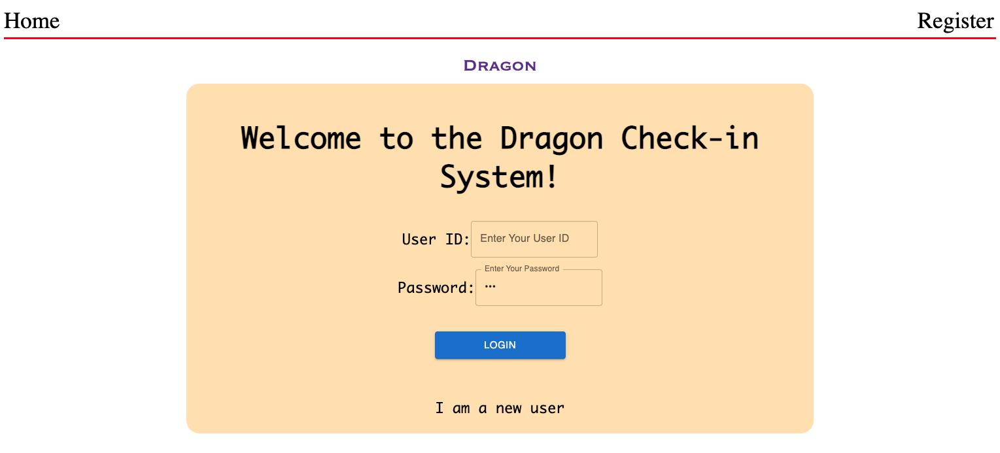
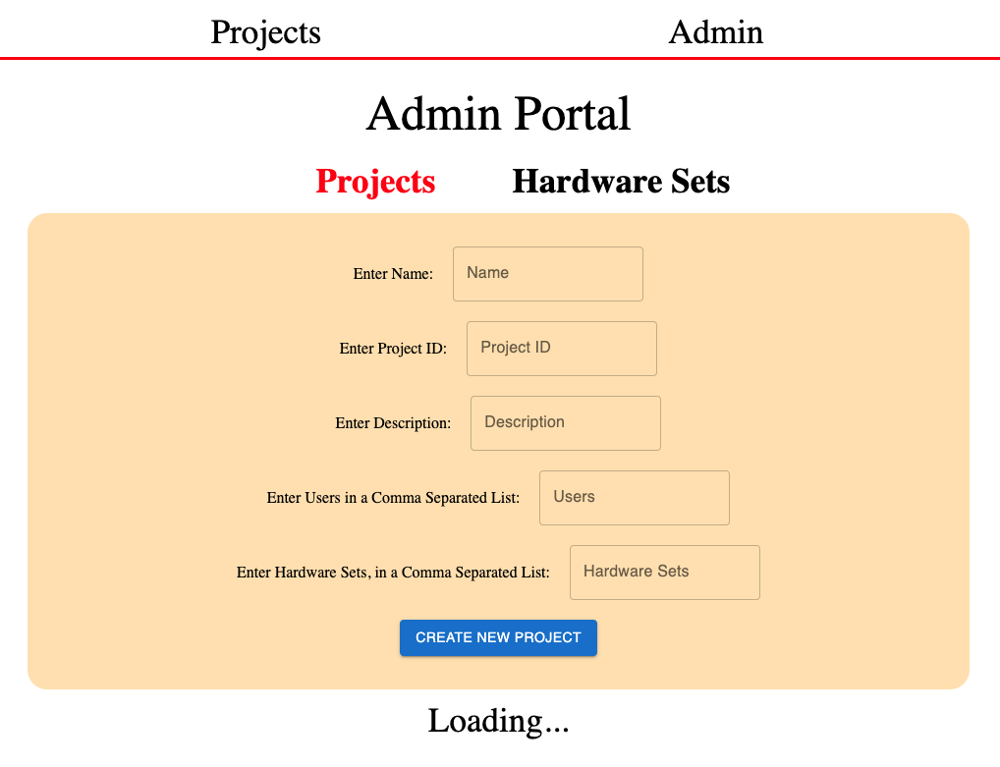
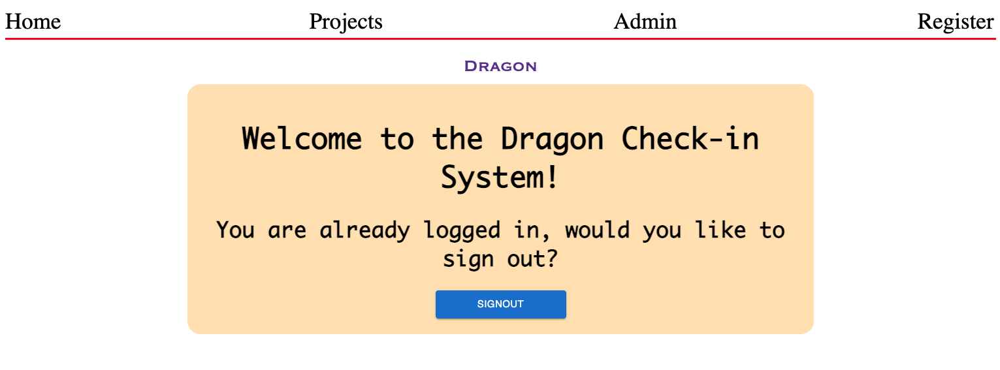

# Dargon App - User Document

### Introduction
- An application that allows users to check in and out for their hardware set within the project ID
- (Landing Page Overview)

### 3 How? Of Getting Started & Installation
- How to clone the project?
1. click the green, Code dropdown menu button
2. On the Local tab, click HTTPS under clone
3. Copy the link underneath HTTPS 
4. In a command prompt: navigate to a directory you'd like to have the code located in
	a. you can do this using the 'cd' command on windows and pasting the file path after it
	b. for example: "cd C:\Users\Cord\eclipse-workspace"
5. then entire the following command:
	a. "git clone https://github.com/vannyyeh/ECE461Project_Dragon.git"

- How to initializing your local development environment?
1. Navigate into the repo that you just cloned onto your computer in a command prompt
2. venv: In order to keep our work environments ~fairly~ clean and separate from each other we need to create what is called a virtual environment
	a. A virtual environment allows us to download multiple libraries that our project depends on without adding it to a global environment on our computer
		i. for example: On my system, outside our projects repo and virtual environment (venv), I have installed a JSON parsing library
			My project will not have dependencies on this JSON parser, so I create a venv where I install the following libraries: webpack, and Django. Once activated,
			my venv restricts the libraries that my code can access strictly to the ones installed in my venv, those being webpack and Django. 
	b. In order to activate your venv, we are going to call its activate script, which resides among other useful scripts (which we probably won't use) inside the Scripts folder in venv.
		i. Depending on where you are in the file directory this command will change as all its doing is telling the computer to run whatever is at that location
			1. side note: this may only work on Windows, if you don't use windows, just double click the activate script in the Scripts folder under venv
		ii. If you are in the root directory of your local repo, the command will look like this:
			1. ".\venv\Scripts\activate"
3. pip install: Now that you have a venv and it is active, you need to install all the dependencies that this project requires to run successfully.
	a. I have included a requirements.txt file in the root directory of the project which contains all the dependencies and their versions used by the project.
	b. If you have python, pip comes packaged with it. pip is a package manager for python. Long story short: it downloads stuff
	c. in the main directory, enter the following command:
		i. "pip install -r requirements.txt"
	d. That command will open the requirements.txt file and install every dependency with the specified version listed. I recommend looking in that file to see what's installed.
	e. If you add a dependency to the project in the future, you need to add the name of the library (that pip would call to install) and its version like this:
		library1==3.1
		library2==1.3.4.5
		library3==13.2.2
	f. or you can use the following command to update the requirements file automatically (if you are in the root directory)
		i. pip3 freeze > requirements.txt
	g. NOTICE: our dependencies may differ across machines and we should like include the requirements.txt file in the gitignore later
4. You now have the required code to develop without any errors except for your own! yay!

- How to run the app?
1. Start the flask server by running in the /backend directory:
`flask run`
2. Start the React development server by navigating to /frontend directory:
`npm start`

By following these steps, the application should be able to run your React and Flask applications on the local machine 
and see the user interface now:)

### Sign In/Sign Up UI
- Users can log into their accounts by providing their user ID and password
- If the user does not have an existing account, the user will follow the "I am a new user" to register the account
- After the user register one account, it will navigate back to the landing page by defalut log in by having the new username and password

### Hardware Check-in/ Check-out Page UI

- In the project portal page, the user will be able to see the project it has and authorized users, 
hardware sets, and a join/leave project button
- The user must join the project to check in and check out the hardware set
- If the user request to check out more hardware than the available set, the maximum amount of hardware will be checked 
out to that project, vice versa

- The user can add the project to their account if they have permission

### Admin Portal 

- Admin portal allows adminstrator to manage users and hardware, project

### Sign Out

- User is allowed to sign out from the account to log in back by other account or etc..